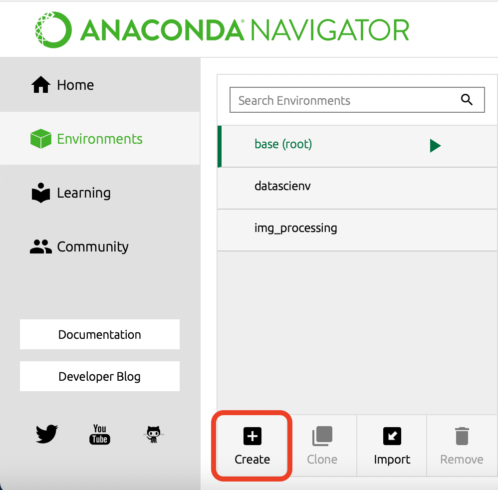
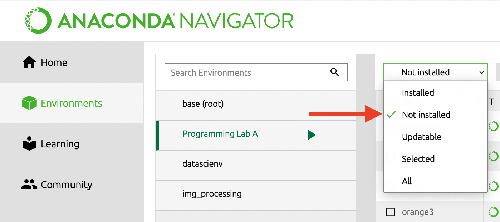

There are a couple options for setting up your environment with Python. You can install all your tools **piece-by-piece**, or you can install an **all-in-one** virtual environment that contains everything you need.

## Piece-by-Piece

With this method, you will need to install Python, a text editor, and Jupyter separately. 
1. Download and install Python from <a href="https://www.python.org/downloads/" target="_blank">python.org</a>. Make sure you include "pip" in **Optional Features** and "Add Python to environment variables" in **Advanced Options**.
2. Open a terminal (such as Windows CMD, <a href="https://git-scm.com/downloads" target="_blank">Git Bash</a>, or iTerm) and check the installation with this command:
   ```bash
   python --version
   ```
   If you see the python version print to the console then you are ready for the next step. If not, you may need to set your PATH variable on Windows to use the Python executable.
3. In the terminal, install <a href="https://jupyter.org/install" target="_blank">JupyterLab</a> with this command:
   ```bash
   pip install jupyterlab
   ```
   If the command line does not recognize `pip`, then you can try:
   ```bash
   python -m pip install jupyterlab
   ```
   If pip in not installed, then the command above will also fail. In that case, check <a href="https://pip.pypa.io/en/stable/installing/" target="_blank">here</a> for instructions on installing pip.
4. After installation completes, launch *JuptyerLab* with the command:
   ```bash
   jupyter-lab
   ```
   Alternatively, the *Jupyter Notebook* app is more lightweight and may be easier for beginners. You can run it with this command:
   ```bash
   jupyter notebook
   ```
5. Download and install a text editor if you do not have one already. 
   <a href="https://code.visualstudio.com/download" target="_blank">Visual Studio Code</a> is a popular free editor with extensions for Python and Jupyter.

## All-in-One

With this method, you can simply install Anaconda. Anaconda is a virtual environment application with an intuitive interface for managing your tools and software configurations. With Anaconda, you can easily run VSCode, Jupyter Lab, or a terminal with all the necessary configurations.
1. Download and install Anaconda from <a href="https://www.anaconda.com/products/individual" target="_blank">anaconda.com</a>.
2. Once install completes, open *Anaconda Navigator* and click the **Environments** tab.
3. Create a new environment for this course "Programming Lab A".
   *Make sure to choose Python 3.7 or higher for the environment.
   
4. After the environment is created, click on it and open the list of packages that are not installed from the drop-down menu.
   
5. Check the boxes next to **jupyterlab** and **notebook** if you see them on the list.
6. Click **Apply** and wait for the installation to complete.
7. Return to the **Home** tab. You should now be able to launch *JupyterLab*.

## Hello, Python!

After installing everything, try to get a simple Python program working so you can confirm that there are no problems with your environment.
1. Open a terminal. If you installed **piece-by-piece**, this will be your computer terminal, such as Windows CMD. If you installed **all-in-one**, then open the *Anaconda Navigator*, make sure you have the "Programming Lab A" environment running, and click "Launch" on the *CMD.exe Prompt* or *Powershell*
2. Type `python` and press enter to run the Python interpreter. This will show the Python prompt `>>>` which means you can type Python code directly into the terminal.
3. Type this line of code and press enter:

   ```python
   print("Hello, Python!")
   ```
4. If you see the message echoed back to you, then everything is ready!
5. Type `exit()` to back out of the Python interpreter.